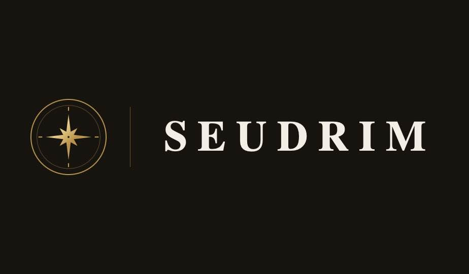

### Intelligence needs a bearing.

Software products powered by artificial intelligence — 
each one steering by the same north star.

[**seudrim.com**](https://seudrim.com) &nbsp;·&nbsp; _Ad Astra · Per Machinam_

---

## ✦ The north star

Our north star is **Ithaca** — the destination of the Western journey, and the
reason, order, and human freedom it has always stood for.

## ✦ What guides us

| | | |
|---|---|---|
| **I — Reason** | **II — Order** | **III — Freedom** |
| Every product begins with a clear argument for why it should exist. We build what reason can defend, and nothing it cannot. | Intelligence without structure is noise. We give it proportion — systems that are legible, durable, and built to hold. | Our products serve the people who use them. Technology should widen human agency — never quietly narrow it. |

## ✦ Pursuits

Seudrim is built to ship more than one thing. The first products are underway —
each a different instrument, the same bearing.

## ✦ The company

Seudrim, Inc. is a Delaware corporation building artificial-intelligence software
for a global market. A small company with a long horizon — patient about the
destination, exacting about the craft.

| Founded | Focus | Market |
|:--:|:--:|:--:|
| MMXXVI | Software | Global |

---

**Begin the voyage** → [hello@seudrim.com](mailto:hello@seudrim.com) &nbsp;·&nbsp; [careers@seudrim.com](mailto:careers@seudrim.com)

© MMXXVI Seudrim, Inc. · Ad Astra · Per Machinam

